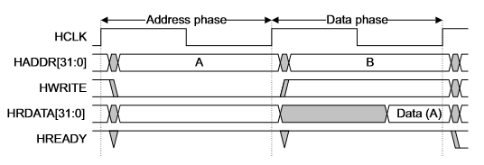
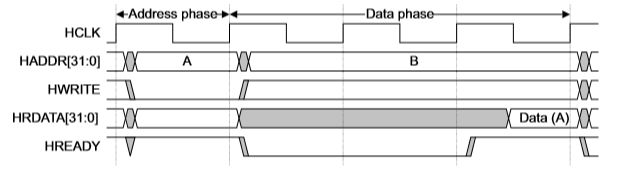
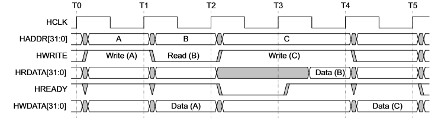

# MIPS

使用Verilog实现的32位MIPS架构CPU, 能够运行一个简单的操作系统[ucore](https://github.com/chyyuu/ucore_os_lab).

## 背景

这是我在大三学习计算机组成原理和软件工程时完成的大作业, 要求是写一个CPU并烧进一块开发板里, 在开发板里运行一个简单的16位监控程序. 扩展要求是用这个CPU跑起来操作系统课的教学操作系统ucore(32位).

## 演示与文档

视频: [av88281655](https://www.bilibili.com/video/av88281655/) (共2p)

[需求文档](./doc/需求文档.pdf) [设计文档](./doc/设计文档.pdf) [测试文档](./doc/测试文档.pdf) [管脚分配](./doc/管脚分配.pdf)

## 主要功能

* 使用提供的开发板, 设计了一个基于标准32位MIPS指令集的5级流水CPU, 采用小端序, 支持异常, 中断, TLB等功能

* 在CPU上运行操作系统, 进入用户态和shell, 能够执行shell命令.

* 为CPU增加调试功能, 能够设置硬件断点.

* 实现对串口, VGA, PS/2键盘的支持.

* CPU频率达到25M.

## 实验设备与开发环境

开发板中含有:

* FPGA一块, 为Xilinx的Spartan6 xc6slx100.

* CPLD一块, 用于PS/2 IO.

* 32位RAM两块, 各4MB, 共计8MB.

* 16位Flash一块, 共8MB.

开发环境为Xilinx ISE, 使用的操作系统为清华大学操作系统课程实验的32位操作系统ucore, 编译器为mips-sde-elf-gcc.

## 指令集

#### 寄存器

CPU含有32个通用寄存器, 分别以\$0-\$31命名. 其中\$0在任何时刻的值均为 0, 不受写入的影响. 为了处理整数乘法, CPU还含有两个整数乘法寄存器hi, lo. 为支持操作系统, CPU还含有协处理器0, 简称CP0. 

#### 指令

根据操作系统的需求, CPU实现了如下指令:

运算指令: addu, addiu, subu, slt, slti, sltu, sltiu, mult, mflo, mfhi, mtlo, mthi, and, andi, lui, nor, or, ori, xor, xori, sll, sllv, sra, srav, srl, srlv.

分支指令: beq, bne, bgez, bgtz, blez, bltz, j, jal, jr, jalr.

访存指令: lw, sw, lb, lbu, sb.

陷入指令: syscall.

特权指令: eret, mfc0, mtc0, tlbwi.

#### 协处理器

根据操作系统的需求, CP0包含如下13个寄存器:

* 0 index

* 2 entrylo0

* 3 entrylo1

* 10 entryhi 上面四个寄存器用于指令tlbwi, 详情请见[TLB](#TLB). 

* 8 badaddr 导致最近地址相关异常的地址.

* 9 count 计时器, 每个CPU工作周期加1. 

* 11 compare 计时器, 当compare寄存器等于count寄存器时产生time interrupt.

* 12 status CPU 的状态. 各位的描述:

|位|功能|
|---|---|
|bit 15-8|interrupt manager(im) 7-0 使能某种中断|
|bit 4|user mode(um) 处于用户态|
|bit 1|exception(exl) 发生了异常, 此时禁止中断|
|bit 0|interrupt enable(ie) 使能中断|

* 13 cause

|位|功能|
|---|---|
|bit 31|exception in delay slot(bd) 异常发生在延迟槽中|
|bit 15-8|interrupt(ip) 此时是否发生对应的中断|
|bit 6-2|exception code(ec) 异常种类|

* 14 epc 异常或中断的发生或返回地址

* 15 ebase 异常入口点地址

* 18 watchlo

* 19 watchhi 断点的地址, 详情请见中断处理部分. 

与CP0相关的指令有mfc0和mtc0, 它们的作用为在通用寄存器和CP0之间转移数据. CP0中的所有寄存器都是可读写的. 

#### TLB

为了实现对操作系统的支持, CPU需要把虚拟地址翻译到物理地址. 这通过TLB进行. 

TLB中有16个表项, 每一项有64bit. 各位的定义如下: 

| 位 | 功能|
| -------- | ------------------------------------ |
| bit62-44 | virtual page number(vpn) 虚拟页号    |
| bit43-24 | physical page number0(ppn0) 物理页号 |
| bit23    | valid0 表示这一页是否有对应的物理页  |
| bit22    | write0 表示这一页是否可写            |
| bit21-2  | physical page number1(ppn1) 物理页号 |
| bit1     | valid1 表示这一页是否有对应的物理页  |
| bit0     | write1 表示这一页是否可写            |

操作系统要求虚拟页和物理页的大小都为4kB. TLB中每一项都对应2个连续的虚拟页. 在查找一个虚拟地址对应的物理地址时, 首先把这个虚拟地址的31-13位与每一项的vpn进行匹配, 如果没有相同的, 则报告TLB缺失. 如果有相同的, 考虑虚拟地址的第12位, 根据它为0或1来选择ppn0或ppn1. 以第12位等于0为例, 如果valid0为0, 直接报告TLB缺失. 如果这个操作是写操作, 且write0为0, 则报告权限错误. 之后把ppn0和虚拟地址的11-0位结合起来就得到虚拟地址. 

与TLB相关的指令有tlbwi, 它的作用为把CP0中index, entrylo0, entrylo1, entryhi这四个寄存器中的相关信息写入TLB中. 四个寄存器的含义如下: 

index

| 位 | 功能|
| -------- | ------------------------------------ |
| bit3-0 | 表示要写入的 TLB 表项的序号|

entrylo0

| 位 | 功能|
| -------- | ------------------------------------ |
| bit25-6 | physical page number0(ppn0) 物理页号 |
| bit2    | write0 表示这一页是否可写            |
| bit1    | valid0 表示这一页是否有对应的物理页  |

entrylo1

| 位 | 功能|
| -------- | ------------------------------------ |
| bit25-6 | physical page number0(ppn1) 物理页号 |
| bit2    | write1 表示这一页是否可写            |
| bit1    | valid1 表示这一页是否有对应的物理页  |

entryhi

| 位 | 功能|
| -------- | ------------------------------------ |
| bit31-13 | virtual page number(vpn) 虚拟页号 |

#### 异常与中断

CPU需要支持中断和异常. 根据操作系统的需求, CPU需要支持的异常有: 

* 0 interrupt 外部中断. 需要处理的中断有: 

    * 4 serial interrupt 由串口控制器产生

    * 7 time interrupt 由CP0产生

    中断在每个工作周期检测一次, 检测到中断产生的条件为: cp0.status.ie=1, cp0.status.exl=0, cp0.status.im中允许相应的中断, 并且外部的中断信号为1. 
* 2 tlb miss on load 读数据时如果TLB中没有保存相应的映射, 则产生此异常

* 3 tlb miss on store 写数据时如果TLB中没有保存相应的映射, 则产生此异常

* 4 address error on load 当读取一个字的地址不是4的倍数时, 或在用户态读取内核态的地址时, 产生此异常. 

* 5 address error on store 当写入一个字的地址不是4的倍数时, 或在用户态写了内核态的地址时, 或写了只读页面时, 产生此异常. 

* 8 syscall 执行syscall指令时产生此异常. 

* 10 reserved instruction 当指令不合法或在用户态执行了mfc0/mtc0/tlbwi时, 产生此异常. 

* 23 debug 当前的PC与CP0中的watchlo或watchhi相同时, 产生此异常. 

异常处理过程: 设置cp0.epc指向异常处理之后重新开始执行的地址, 如果异常发生在延迟槽外, 则设置为发生异常指令的地址, 否则为设置为延迟槽前跳转指令的地址, 对于中断, 则设置为刚结束alu阶段的指令地址. cp0.status.exl置为1, cp0.cause记录下异常号、中断号以及是否在延迟槽中, cp0.badaddr置为最近一次发生错误的地址. 然后跳转到异常入口点, 异常为tlb miss时目标为cp0.ebase, 其余异常目标为cp0.ebase+0x180. 指令eret的作用为把cp0.status.exl置为0, 并跳转到cp0.epc. 

#### 启动

CPU启动时从0xbfc00000开始执行, 状态为核心态, 关闭所有中断. 

## CPU设计

#### 流水线

CPU采用5级流水线结构, 5个阶段分别为取指, 译码, 运算, 访存, 写回. 在同一时刻, 最多可以有5条指令在流水线上执行. CPU的流水线部分由以下9个部分组成. 

* PC: 表示当前要取的指令的地址. 正常情况下, 每个时钟周期地址增加4. 同时PC还要对跳转和异常作出正确的反应. 如果PC指向的地址需要TLB映射并且TLB中找不到对应的虚拟地址, 则报告发生 tlb miss on load 异常, 

* IF/ID: 取指阶段和译码阶段之间的流水线寄存器. 

* ID: 译码. 根据指令, 判断指令的类型, 决定是否要读寄存器, 是否要读/写内存, 指令的特权等级. 并检测syscall异常, reserved instruction异常. 判断跳转指令是否进行跳转. 然后把所有后续需要的信息传给下一阶段. 

* ID/EX: 译码阶段和运算阶段之间的流水线寄存器. 

* EX: 运算. 计算算术运算指令的结果和访存指令的内存地址. 把后续需要的信息传给下一阶段. 

* EX/MEM: 运算阶段和访存阶段之间的流水线寄存器. 

* MEM: 访存. 检测interrupt/tlb miss on load/tlb miss on store/address error on load/address error on store/debug 异常. 

* MEM/WB: 访存阶段和写回阶段之间的流水线寄存器. 

* WB: 写回. 写回的寄存器目标包括通用寄存器/hi/lo/cp0. 

#### 冲突的处理

对于数据冲突, 我们采用数据旁路的方法来解决. 读寄存器的操作全部发生在译码阶段. 把运算阶段和访存阶段的指令要修改的寄存器和要写入的值传给译码阶段, 就可以解决冲突. 对于译码阶段和写回指令的冲突, 我们在寄存器模块解决, 即一个寄存器如果要同时读或写, 读出的值就是要写入的值. 但如果一条load指令读取的值在紧邻的指令中要用到, 就不能用数据旁路的方法来解决. 这时让流水线暂停一周期. 

对于结构冲突, 在访存和取指同时发生时, 暂停一周期. 

对于控制冲突, 在跳转指令的译码阶段得出是否跳转, 并传给PC. 

#### 流水线暂停

在需要流水线暂停时, 我们保持PC模块, IF/ID模块的值不变, ID/EX模块的输出置为空指令的输出, EX/MEM模块和MEM/WB模块的输出和流水线正常运行时的输出相同. 这样等效于在EX阶段插入了一个空指令. 为了使异常处理能够正确处理插入的空指令, 这一空指令的PC应该等于译码阶段的PC, 是否在延迟槽中这一属性也应该和译码阶段的指令一致. 为实现这一功能, 我增加了一个新的模块control. 

#### 异常处理

为了进行异常处理, 在流水线的各个阶段都要收集必要的异常信息, 然后统一汇总到control模块. control模块根据收集到的信息决定是否要引发异常. 如果要引发异常, 则发出flush信号. 除MEM/WB和寄存器模块之外, 其它的流水线寄存器都要清空, 输出变为空指令的输出. 

## 外设

#### 物理地址映射

根据操作系统的需求, 我们把各种设备均映射到了物理地址空间中.

| 设备 | 映射 |
| ----- | ---------------------------------------------- |
| ROM   | 0x1fc00000-0x1fc001ff 映射到 0x000-0x1ff       |
| RAM   | 0x00000000-0x003fffff 映射到 0x000000-0x3fffff |
| Flash | 0x1e000000-0x1effffff 映射到 0x000000-0x7fffff |
| 串口  | 0x1fd003f8-0x1fd003ff 映射到 0x0-0x7           |
| VGA   | 0x10000000-0x10000fff 映射到 0x000-0xfff       |

串口的地址空间为0x0-0x7, 其中0x0-0x3为数据寄存器, 对它的读写相当于读串口或写串口/键盘. 0x4-0x7为数据寄存器, 表示串口的输入缓冲区中有数据. 当串口或键盘有字符输入时, 把字符写入缓冲区中. 当一个数据被写入缓冲区时, 串口控制器发出中断, 持续时间为一个CPU工作周期. 

#### 总线

为了设计的简洁, 我们实现了AHB-Lite总线协议. 其主要原理如图所示. 

图中共有两个时钟周期, 在第一个时钟周期开始时, CPU 把要读写的地址以及是否要读写放到总线上. 在第二个时钟周期开始时, 外设得到要读写的地址. 在第三个时钟周期开始时, CPU得到读写的数据. 

对于慢速设备, 在读写没有完成时, 可以把Hready信号置为低, 这样CPU就会保持状态不变, 直到Hready回到高为止. 读写完成时把Hready信号置为高. 

上述读写方式每次需要两个总线周期. 我们采用了一种流水线的方式来让CPU和总线同步. 在上图中, 在第一个时钟周期CPU发出写A的命令. 在第二个时钟周期外设写A, 同时CPU又可以发出读B的命令, 这样就实现了同步. 

## 调试

为了实现调试功能, 我们实现了两个cp0寄存器watchlo/watchhi. 当PC等于这两个寄存器之一时触发23号调试异常. 读写这两个寄存器可以通过mfc0和mtc0来实现. 